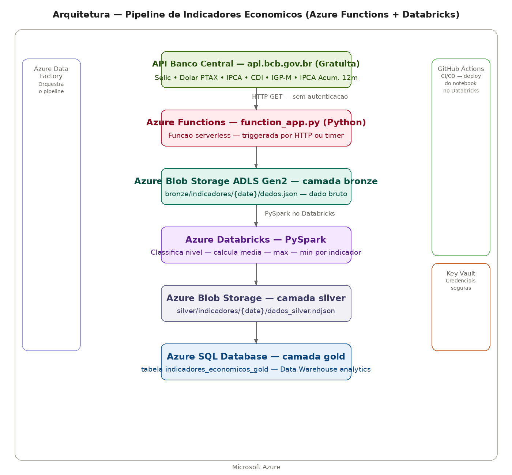

# Pipeline de Indicadores Econômicos — Azure Functions + Databricks

Pipeline de dados que extrai indicadores econômicos oficiais do Banco Central do Brasil via Azure Functions serverless, aplica medallion architecture com camadas bronze, silver e gold usando Microsoft Azure com PySpark no Databricks.

## Arquitetura



**Ingestão:** Azure Function em Python extrai os indicadores econômicos da API do Banco Central — Selic, Dólar PTAX, IPCA, CDI, IGP-M e IPCA Acumulado 12 meses — triggerada por HTTP ou timer.

**Bronze:** Dados brutos em JSON preservados no Azure Blob Storage com ADLS Gen2.

**Silver:** Notebook PySpark no Azure Databricks transforma os dados — classifica o nível de cada indicador, calcula média, máxima e mínima por série. Salvo como NDJSON no Blob Storage.

**Gold:** Dados modelados carregados no Azure SQL Database via conector nativo do Spark.

**Credenciais:** Azure Key Vault armazena todas as credenciais de forma segura.

**CI/CD:** GitHub Actions deploya automaticamente o notebook PySpark no Databricks a cada push na pasta functions/.

**Infraestrutura:** Toda infraestrutura provisionada via Terraform — Resource Group, Blob Storage ADLS Gen2, Key Vault, Azure Functions App e Data Factory.

## Indicadores monitorados

| Indicador | Código BCB | Frequência |
|---|---|---|
| Selic | 11 | Diária |
| Dólar PTAX | 1 | Diária |
| IPCA | 433 | Mensal |
| CDI | 12 | Diária |
| IGP-M | 189 | Mensal |
| IPCA Acumulado 12m | 7326 | Mensal |

## Tecnologias Azure

| Serviço | Função | Equivalente AWS | Equivalente GCP |
|---|---|---|---|
| **Azure Functions** | ETL serverless | Lambda | Cloud Functions |
| **Azure Blob Storage ADLS Gen2** | Data Lake bronze e silver | S3 | Cloud Storage |
| **Azure Databricks** | PySpark distribuído | EMR | Dataproc |
| **Azure SQL Database** | Data Warehouse gold | RDS | Cloud SQL |
| **Azure Key Vault** | Credenciais seguras | Secrets Manager | Secret Manager |
| **Azure Data Factory** | Orquestração | MWAA | Cloud Composer |
| **GitHub Actions** | CI/CD | CodePipeline | Cloud Build |
| **Terraform** | Infraestrutura como código | Terraform | Terraform |

## Medallion Architecture

**Bronze (Blob Storage ADLS Gen2):** JSON bruto exatamente como veio da API do Banco Central.

**Silver (Blob Storage NDJSON):** Uma linha por registro com classificação do nível do indicador e valor arredondado.

**Gold (Azure SQL Database):** Tabela `indicadores_economicos_gold` pronta para consultas analíticas SQL.

## Transformações PySpark — camada silver

- **classificacao** — nível do indicador por série:
  - Selic/CDI: alta (≥12%), moderada (≥8%), baixa (<8%)
  - IPCA: alta (≥0.5%), moderada (≥0.2%), baixa (<0.2%)
  - Dólar: alto (≥6), moderado (≥5), baixo (<5)
- **valor_arredondado** — valor com 4 casas decimais

## Resultado da extração — 2025

| Indicador | Média | Máxima | Mínima |
|---|---|---|---|
| Selic | 5,35% a.m. | 5,51% | 4,55% |
| Dólar PTAX | R$ 5,46 | R$ 6,21 | R$ 4,90 |
| IPCA | 0,42% a.m. | 1,31% | -0,11% |
| CDI | 5,35% a.m. | 5,51% | 4,55% |

## Azure Functions — estrutura

```python
@app.route(route="extract", auth_level=func.AuthLevel.ANONYMOUS)
def extract_indicadores(req: func.HttpRequest) -> func.HttpResponse:
    # Extrai indicadores do Banco Central
    # Salva no Azure Blob Storage (bronze)
    # Retorna JSON com status e total de registros
```

A função pode ser triggerada por:
- **HTTP** — chamada direta via URL
- **Timer** — agendamento automático (ex: todo dia útil às 9h)
- **Event Grid** — em resposta a eventos da Azure

## Queries no Azure SQL Database

```sql
-- Historico da Selic
SELECT data, valor, classificacao
FROM indicadores_economicos_gold
WHERE indicador = 'Selic'
ORDER BY data DESC;

-- Comparativo entre indicadores
SELECT indicador, AVG(valor) as media, MAX(valor) as maximo, MIN(valor) as minimo
FROM indicadores_economicos_gold
GROUP BY indicador
ORDER BY indicador;

-- Dias com dolar acima de R$ 6
SELECT data, valor
FROM indicadores_economicos_gold
WHERE indicador = 'Dolar PTAX' AND valor >= 6
ORDER BY data DESC;
```

## Como rodar

### 1. Criar infraestrutura Azure
```bash
az login
cd terraform
terraform init
terraform apply
```

### 2. Configurar secrets no Databricks
```bash
databricks secrets put --scope licitacoes --key storage-key-indicadores --string-value "<storage-key>"
databricks secrets put --scope licitacoes --key sas-token-indicadores --string-value "<sas-token>"
```

### 3. Rodar extração
```bash
export AZURE_STORAGE_CONNECTION_STRING="<connection-string>"
python functions/extract/function_app.py
```

### 4. Rodar transformação
Execute o notebook `transform_indicadores` no Azure Databricks.

## Autor

**Lucas Magalhães** — Engenheiro de Dados

[](https://github.com/lucasmagalhaess)
[](https://linkedin.com/in/lucasmagalhaes-data)
